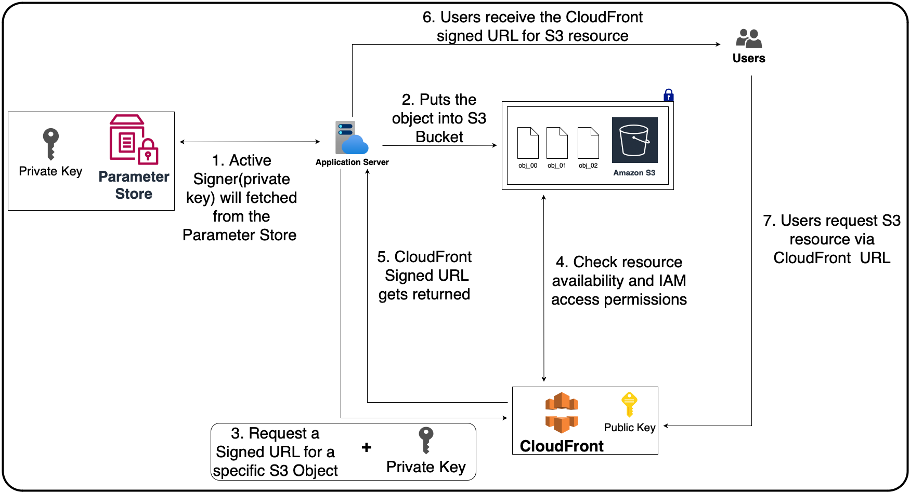

# AWS CloudFront Signed URL generation<br />(by utilizing AWS Parameter Store)

In this Spring Boot application, the CloudFront signed URL generation functionality is implemented to expose the objects <br />residing in an AWS S3 private bucket via the AWS CloudFront Java SDK Version 1.x and SDK Version 2.x.


### Overview of AWS CloudFront Signed URL Generation


## Documentation on AWS Resource provisioning

Please refer the [Medium Blog post](https://medium.com/@deshanranasinghe/expose-aws-s3-private-bucket-objects-via-cloudfront-signed-urls-fab678283622)


## Spring Boot Application Overview 


#### Gradle Dependency Overview

This Application is based on Spring Boot version '3.1.2'.
For demo purposes both AWS CloudFront Java SDK V.1 and V.2 have


**Add Support for AWS SDK V.1 :**  
```
com.amazonaws:aws-java-sdk-s3
com.amazonaws:aws-java-sdk-cloudfront
```

**Add Support for AWS SDK V.2 :**  
```
software.amazon.awssdk:s3
software.amazon.awssdk:cloudfront
```

**integrate AWS parameter store to fetch params:**  
```
io.awspring.cloud:spring-cloud-aws-dependencies
io.awspring.cloud:spring-cloud-aws-starter-parameter-store
```

**perform file manipulation operations:**  
```
commons-io:commons-io
```

**perform conversion of PEM encoded PKCS#1 private key file to DER encoded PKCS#8 private key file:**  
```
org.bouncycastle:bcpkix-jdk15on
```

**alternative library for CloudFront signed url generation:**  
```
net.java.dev.jets3t:jets3t
```

#### Application Setup Details
To configure the IAM authentication via default credentials provider chain, we are setting following environment variables.
```
AWS_ACCESS_KEY_ID
AWS_SECRET_ACCESS_KEY
```

The AWS S3 client will refer the region loaded from the DefaultAwsRegionProviderChain and <br /> 
credentials loaded from the DefaultCredentialsProvider
```
AWS_REGION
```

Additionally, we will set the profile to dev.
```
spring.profiles.active=dev
```

## Implementation Overview

To use AWS CloudFront signed URL capability, we need to use an active trusted signer for the distribution. <br />
To generate this trusted signer we use openssl. 

By running following commands private and public key pair can be generated.<br />
Note that the private key is a PEM encoded PKCS#1 private key file. 

```
openssl genrsa -out private_key.pem 2048
openssl rsa -pubout -in private_key.pem -out public_key.pem
```

**AWS CloudFront supported private key types**
- PEM encoded PKCS#1 private key files 
- DER encoded PKCS#8 private key file

We intend to maintain the signer private key in the AWS Parameter Store since it eases the maintain effort we have to put forward.

The DER encoded PKCS#8 private key files are binary formatted files and its difficult to handle DER encoded signer private key in AWS Parameter Store. <br />
Therefore, we will maintain the PEM encoded PKCS#1 private key content in the AWS Parameter Store. <br />
Additionally, the process to generate a DER encoded PKCS#8 private key file using the PEM encoded PKCS#1 private key file progamatically is possible via the [bouncycastle](https://bouncycastle.org/) library.<br /> 
The specifics of that conversion is mentioned in the AWS CloudFront SDK V.2 Implementation.

Additional details on configuring AWS CloudFront Distribution for singed URLs is available in following [article](https://link)

### Using 3rd party libraries to create CloudFront signed URLs
As an [alternative approach](https://docs.aws.amazon.com/AmazonCloudFront/latest/DeveloperGuide/CFPrivateDistJavaDevelopment.html), AWS CloudFront documentation has provided examples of using [JetS3t](http://www.jets3t.org/) library for signed URL generation. <br />


### AWS Parameter Store integration

To maintain the sensitive information such as the active signer information and other configuration values, we intend to use the AWS parameter store.
To integrate the spring boot application with AWS Parameter Store, [Spring Cloud AWS](https://docs.awspring.io/spring-cloud-aws/docs/3.0.1/reference/html/index.html#spring-cloud-aws-parameter-store) is used.


## API Reference

#### Get CloudFront signed URL via the AWS CloudFront SDK v1.x

```http
  GET /upload/{request-identifier}/sdk-v1/signed-url
```

| Parameter | Type     | Description                |
| :-------- | :------- | :------------------------- |
| `request-identifier` | `string` | **Required**. Unique identifier to identify for S3 file uploads |

#### Get CloudFront signed URL via the AWS CloudFront SDK v2.x

```http
  GET /upload/{request-identifier}/sdk-v2/signed-url
```

| Parameter | Type     | Description                       |
| :-------- | :------- | :-------------------------------- |
| `request-identifier` | `string` | **Required**. Unique identifier to identify for S3 file uploads |


## Demo

#### Application Startup:


#### CloudFront Signed URL generation:


## References
[AWS Repost:Troubleshoot CloudFront signed URLs](https://repost.aws/knowledge-center/cloudfront-troubleshoot-signed-url-cookies)<br />
[Spring Cloud AWS Github repo](https://github.com/awspring/spring-cloud-aws)<br />
[Official Spring Documentation of Spring Cloud AWS](https://docs.awspring.io/spring-cloud-aws/docs/2.4.1/reference/html/index.html)<br />
[Spring Cloud for Amazon Web Services](https://spring.io/projects/spring-cloud-aws)<br />
[AWS CloudFront documentation V 1.x CloudFrontUrlSigner utility class](https://docs.aws.amazon.com/AWSJavaSDK/latest/javadoc/com/amazonaws/services/cloudfront/CloudFrontUrlSigner.html)<br />
[AWS CloudFront documentation V 2.x examples](https://docs.aws.amazon.com/code-library/latest/ug/cloudfront_example_cloudfront_CloudFrontUtilities_section.html)<br />
[AWS CloudFront documentation JetS3t examples](https://docs.aws.amazon.com/AmazonCloudFront/latest/DeveloperGuide/CFPrivateDistJavaDevelopment.html)<br />
[Restricting access to an Amazon S3 origin](https://docs.aws.amazon.com/AmazonCloudFront/latest/DeveloperGuide/private-content-restricting-access-to-s3.html#private-content-creating-oai)<br />
[AWS Github repo: Cloudfront examples](https://github.com/awsdocs/aws-doc-sdk-examples/tree/main/javav2/example_code/cloudfront#readme)<br />
[AWS CLI CloudFront Documentation](https://docs.aws.amazon.com/cli/latest/reference/cloudfront/sign.html)
